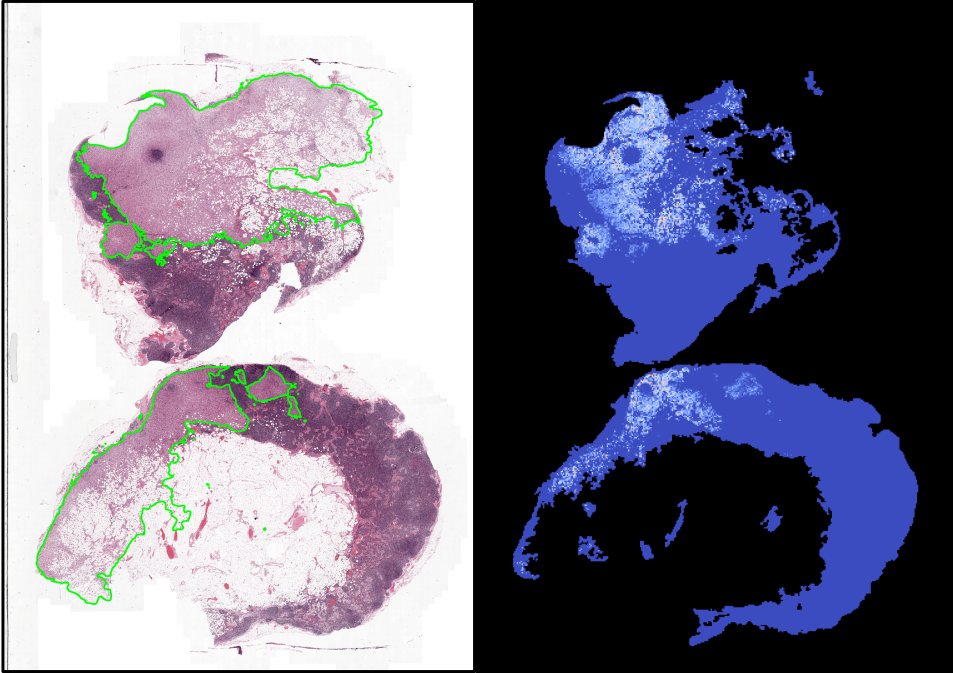

# MS-CLAM

Code associated to the [article](https://www.sciencedirect.com/science/article/abs/pii/S1361841523000245): *MS-CLAM: Mixed supervision for the classification and localization of tumors in Whole Slide Images*, published in **Medical Image Analysis**, Volume 85, April 2023.


MS-CLAM is a mixedly-supervised model for digital pathology. It integrates mixed supervision, i.e., *the concurrent use of slide- and tile-level supervision for whole-slide image tumor classification and localization*. It is based on the well-known [CLAM model](https://github.com/mahmoodlab/CLAM), a weakly-supervised model for interpretable WSI classification. The code allows the user to choose which amount of tile-level labeled slides they wish to use during training, either prespecified or selected randomly.

In this repository, one should find all the necessary elements to:

- train the MS-CLAM model with a specific amount of tile-level labeled slides
- generate attention maps, which map the attention scores of the tiles to a color map showing in red the highest ones, and in blue the lowest.
- generate tumor masks, which are binary masks where each tile that is predicted as tumorous appears in white

## Data provided to improve reproducibility

You can download the data folder from google drive link: [data](https://drive.google.com/drive/folders/1hmMJnHifMh1e92RT-nAKpDh18WSrm6J7?usp=drive_link) **TODO: Add link**

```shell
data
  ├── camelyon16
        ├── patches_fp
              ├── patches
                    ├── normal_001.h5
                    ├── normal_002.h5
                    └── ...
              ├── process_list.csv
        ├── gt_patches_indexes
              ├── test_001.pkl
              ├── test_002.pkl
              └── test_004.pkl
              └── ...
```

You will need to download the camelyon16 slides yourself from the [Camelyon17 challenge website](https://camelyon17.grand-challenge.org/Data/). The slides should be placed in the `data/camelyon16/slides` directory.

## Virtual environment
The file msclam.yml contains the necessary packages for this repository. Simply create a conda virtual environment with:

```shell
conda env create -f msclam.yml
```
Then, activate it with:

```shell
conda activate msclam
```

## Create Patches and Extract Features

Patch creation and feature extraction are performed using the [CLAM repository](https://github.com/mahmoodlab/CLAM)

Clone the CLAM repository at the same level as the MS-CLAM repository:

```shell
cd ..
git clone https://github.com/mahmoodlab/CLAM
cd CLAM
```

Commit of the CLAM repository used in this project: [`38449ae`](https://github.com/mahmoodlab/CLAM/commit/38449aeb25a56486cbbb49d2fbf7cf819ab621e2)

### Create patches

Unfortunately, the preset file used for segmenting tissue and generating patch coordinates for this work was lost. However, to facilitate reproducibility, the patch coordinates generated with [create_patches_fp.py](https://github.com/mahmoodlab/CLAM/blob/master/create_patches_fp.py) and used in the original work are provided in the `data/camelyon16/patches_fp` directory.


If you wish experiment with different tissue segmentation parameters and then to create patches yourself , you first need to create your own preset file by using [build_preset.py](https://github.com/mahmoodlab/CLAM/blob/master/build_preset.py).
```shell
# check other arguments that you can change in the build_preset.py file
python build_preset.py --preset_name camelyon16-default.csv
```

Then, you can create patches and extract features with the following command:
```shell
# tmux new-session -s create-camelyon16-clam-coords
# tmux attach -t create-camelyon16-clam-coords
# conda activate msclam

python create_patches_fp.py \
  --source ../MS-CLAM/data/camelyon16/slides \
  --save_dir ../MS-CLAM/data/camelyon16/clam_generated_patches_fp \
  --patch_size 256 \
  --preset camelyon16-default.csv \
  --seg --patch --stitch
```

Note, we are saving the patches in the `clam_generated_patches_fp` directory not to overwrite the patches used in the original work and provided in the `data/camelyon16/patches_fp` directory.

## Extract features

To extract features, use [extract_features_fp.py](https://github.com/mahmoodlab/CLAM/blob/master/extract_features_fp.py) as shown below. You can speed up the process if you have a GPU with more memory or even multiple GPUs by
- increasing the `batch_size` parameter, e.g. to 512
- setting `CUDA_VISIBLE_DEVICES=0,1,2,3` if you have 4 GPUs

```shell
# tmux new-session -s extract-camelyon16-features
# tmux attach -t extract-camelyon16-features
# conda activate msclam

# patches_fp has the coordinates shared by the authors of MS-CLAM
CUDA_VISIBLE_DEVICES=0 python extract_features_fp.py \
  --data_h5_dir ../MS-CLAM/data/camelyon16/patches_fp/ \
  --data_slide_dir ../MS-CLAM/data/camelyon16/slides \
  --csv_path ../MS-CLAM/data/camelyon16/patches_fp/process_list.csv \
  --feat_dir ../MS-CLAM/data/camelyon16/features/ \
  --batch_size 256 \
  --slide_ext .tif
```

- The h5 files will contain two keys:
  1. `coords`, where an array of size Nx2 should be stored, with the coordinates for all the tiles (openslide format, level 0)
  2. `features`, where an array of size Nxd should be stored, and each row is the latent space representation of a tile in the slide. N is the number of tiles in the slide, and d is the dimension of the embeddings. For instance, if an Imagenet pretrained Resnet-50 is used to extract features, d=1024 (using the implementation of the authors of CLAM). This array is also contained in the .pt files (for faster and easier training).

## Splits

- If using the `--tile_labels_predefined` flag, then the `splits` directory should contain a subdirectory for the dataset, and another one for the dataset with only the annotated slides in the training set. The structure of the `splits` directory then reads (ratio defines the percentage of annotated slides):

```shell
splits/
  ├── dataset_name
        ├── splits_0.csv
        ├── splits_1.csv
        └── ...
  ├── dataset_name_<ratio>
        ├── splits_0.csv
        ├── splits_1.csv
        └── ...
  └── ...
```
## Tile-level labels

To promote reproducibility, we provide the tile-level labels used in the original work in the `data/camelyon16/gt_patches_indexes` directory.
The pickle files that contain the labeled tiles indexes should have the '.pkl' extension. These files contain lists of indexes that match the ones in the .pt or .h5 files. Each index in the list corresponds to a tumorous tile.

## Training
To train the model, simply launch `./main.sh` after you have activated the conda virtual environment. If you wish to use predefined tile labels instead of randomly chosen ones, simply change the `--tile_labels_at_random` flag to `--tile_labels_predefined`.

## Inference

After the `main.py` program finishes, the directory given to the `--results_dir` parameter will contain two csv files: one for the attention scores, and one for the tile-level predictions. The first one is used by the `attention_maps.py` script to generate and save attention maps. The second one is used by the `calculate_dice_score.py` and `get_tile-level_masks.py` scripts to obtain the tile-level tumor maps and tile-level metrics (Dice score, specificity).

The following commands are given assuming that the experiment name in the `main.sh` file has not been changed.

### Attention maps



The following command will generate attention_maps for the available slides

```shell
python attention_maps.py --att_scores_path ./results/camelyon16/msclam_exp_0_s1/attention_scores/fold_0 --dst_dir ./results/camelyon16/msclam_exp_0_s1/attention_maps/fold_0 --slide_dir ./data/camelyon16/slides/ --h5_files ./data/camelyon16/features/h5_files
```

### Tile-level metrics and maps

First, the tile-level maps should be created before the metrics are computed:

```shell
python get_tile-level_masks.py --tile_path ./results/camelyon16/msclam_exp_0_s1/tile_predictions/fold_0 --dst_dir ./results/camelyon16/msclam_exp_0_s1/predicted_masks/fold_0 --slide_dir ./data/camelyon16/slides --thresh 0.5 --patch_size 256 --h5_files ./data/camelyon16/features/h5_files
```

Then, the Dice score and the specificity are obtained thanks to:

```shell
python calculate_dice_score.py --predicted_masks_path ./results/camelyon16/msclam_exp_0_s1/predicted_masks/fold_0/th-0.5/ --tile_predictions_path ./results/camelyon16/msclam_exp_0_s1/tile_predictions/fold_0 --dataset ./dataset_csv/camelyon16.csv --reference_masks ./data/camelyon16/reference_masks # --tile_mask_gt
```

The `--tile_mask_gt` flag can be added to indicate that the reference mask should be the tile-accurate mask, instead of the pixel-accurate one. In the tile_accurate_mask, entire tiles are labeled True or False whether they contain tumor or not.
